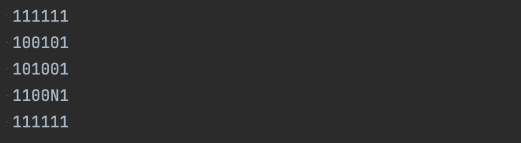
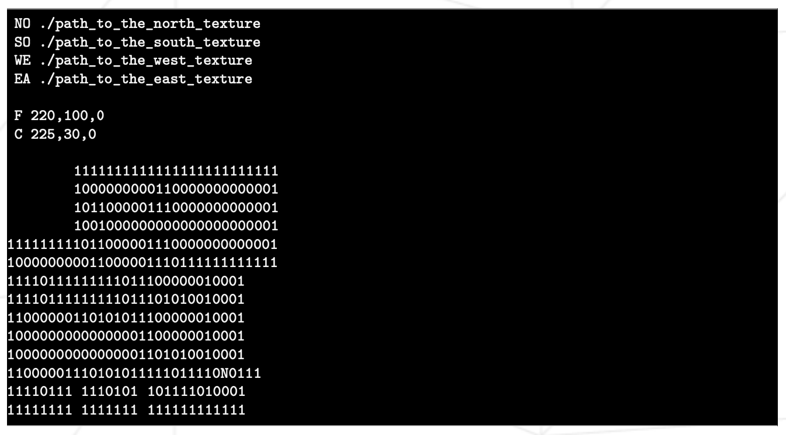

# Cub3D

Необходимо создать "реалистичное" трехмерное представление внутренней части лабиринта с точки зрения от первого лица с использованием принципов [рейкастинга](https://ru.wikipedia.org/wiki/Ray_casting).

Название программы - Cub3D

Makefile - all, clean, fclean, re, (bonus)

Аргументы - карта в формате *.cub

Разрешенные функции - open, close, read, write, printf, malloc, free, perror, strerror, exit, все функции библиотеки math (-lm man man 3 math), все функции библиотеки MinilibX.

## Особенности реализации

- Обязательное использование miniLibX, разрешается использование своей библиотеки libft.
- Отображать разные текстуры стен (на свой выбор), которые различаются в зависимости от того, в какой стороне находится стена (север, юг, запад, восток)
- Программа должна уметь отображать разные цвета пола и потолка.
- Программа отображает изображение в окне и соблюдает следующие правила:
  - Левые и правые стрелки клавиатуры должны позволять посмотреть налево и направо в лабиринте
  - W, A, S и D должны позволять перемещать точку обзора по лабиринту
  - Нажатие Esc и на "крестик" закрывает окно и делает выход из программы
  - Использование образов miniLibX
- Программа принимает первым аргументом описание уровня (лабиринта) в виде файла *.cub
  - Карта должна состоять только из шести возможных символов:
    - `0` для пустых мест
    - `1` для стен
    - `N`, `S`, `E` или `W` для стартовой позиции игрока и направлении (взгляда) при появлении
    - Пример простой валидной карты (игрок будет смотреть на "север" при появлении):
    
    - Карта должна быть закрыта/окружена стенами, если нет - возвращение ошибки
    - Кроме содержания карты, каждый элемент может быть разделен одной или несколькими пустыми строками
    - За исключением карты, каждый тип информации из элемента может быть разделен одним или несколькими пробелами.
    - Карта должна быть проанализирована так, как она выглядит в исходном файле. Необходимо парсить карту любого размера, если она соответствует всем правилам
    - Для каждого элемента (кроме карты) первой информацией является идентификатор типа (один или два символа), за которым следует вся информация для каждого элемента в строгом порядке. Примеры:
      - Северная текстура:
        - `NO ./path_to_the_north_texture`
          - идентификатор: `NO`
          - путь до северной текстуры
      - Южная текстура:
        - `SO ./path_to_the_south_texture`
          - идентификатор: `SO`
          - путь до южной текстуры
      - Западная текстура:
        - `WE ./path_to_the_north_texture`
          - идентификатор: `WE`
          - путь до западной текстуры
      - Восточная текстура:
        - `EA ./path_to_the_south_texture`
          - идентификатор: `EA`
          - путь до восточной текстуры
      - Цвет пола:
        - `F 220,100,0`
          - идентификатор: `F`
          - RGB цвета в диапазона [0,255]
      - Цвет потолка:
        - `C 225,30,0`
          - идентификатор: `C`
          - RGB цвета в диапазона [0,255]
    - Пример основной части с минималистичной картой *.cub:
    
    - Если в файле есть какая-либо неверная конфигурация, программа должна корректно завершиться с ошибкой "Error\n", за которой следует явное сообщение об этой ошибке